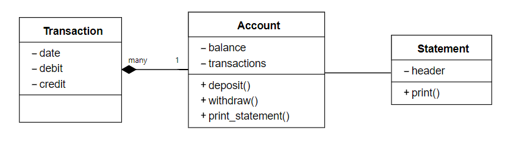

# Bank tech test

## Requirements

* You should be able to interact with your code via a REPL like IRB or the JavaScript console.  (You don't need to implement a command line interface that takes input from STDIN.)
* Deposits, withdrawal.
* Account statement (date, amount, balance) printing.
* Data can be kept in memory (it doesn't need to be stored to a database or anything).

## Acceptance criteria

**Given** a client makes a deposit of 1000 on 10-01-2012  
**And** a deposit of 2000 on 13-01-2012  
**And** a withdrawal of 500 on 14-01-2012  
**When** she prints her bank statement  
**Then** she would see

```
date || credit || debit || balance
14/01/2012 || || 500.00 || 2500.00
13/01/2012 || 2000.00 || || 3000.00
10/01/2012 || 1000.00 || || 1000.00
```

## Usage

### How to run program:
IRB:
```
# instructions on how to run in IRB here.
```

### How to run tests:

```
# instructions on how to run tests here. 
```

## User Stories

```
As a client,
So that I can save money in my bank account, 
I'd like to be able to deposit money.
```

```
As a client,
So that I can use money from my bank account, 
I'd like to be able to withdraw money.
```

```
As a client,
So that I know how much money I have, 
I'd like to be able to print my balance.
```

```
As a client,
So that I can manage my budget,
I'd like to be able to see transaction dates on my account statement. 
```

```
As a client,
So that I can see the most relevant information first,
I'd like to see the transactions in reverse chronological order.
```

## Approach

* I created user stories from the requirements and acceptance criteria.

* I created a functional representation of the user stories in order to help create the class diagrams. 
<details>
    <summary>Click to expand: nouns and verbs table</summary>

**Nouns**
| Nouns | Owner/Property owned? |
|---|---|
| Account | Owner |
| balance (money) | Property owned by Account |
| date | Property owned by Transaction |
| Transaction | Owner |
| transactions | property owned by Account |
| Statement | Owner |
| debit/credit (amount) | Property owned by Transaction |


**Verbs**
| Actions | Owned by? | Property it reads/changes? | Property owned by? |
|---|---|---|---|
| deposit | Account | balance | Account |
| withdraw | Account | balance | Account |
| print_statement | Account | print | Statement |

</details>


* Class diagram:



* Starting with the first user story, using a TDD approach, I implemented a deposit feature that increases the balance. The deposit method returns the balance. 

* Depositing money creates a transaction, I used dependency injection to inject the Transaction class double.

* Moving on to the second user story, I implemented the withdrawal feature that decreases the balance, but not below 0. The method returns the balance. Withdrawing money creates a transaction. 

* Wrote a test that fixed a bug where you could not withdraw the exact balance in the account. 

* Moving onto the third user story; since I have planned to create a `Statement` class, I wrote a test in `account_spec` to check that the `print` method would be called on an instance of `Statement`. 

* Wrote a feature test for printing the statement to guide the creation of Transaction and Statement classes BDD style.

* Working with the `Statement` class, I test drove the creation of the `print` method into the format required. Taking into account the 4th & 5th user story, the transactions are ordered into reverse chronological order before being 'printed'.

* Working with the `Transactions` class, I test drove the attributes that are required by the other classes. Using the `timecop` gem, I was able to test that the date is stored when a transaction is created. 

* Circling back to the feature tests, my tests were now failing due to the wrong arguments given to initialise new transactions (debit and credit amounts were not being passed to the transaction). I replicated the failure in the unit test and then implemented the change to make them pass.

* Considering more edge cases:
  * Input negative number for deposit
  * Input negative number for withdrawal
  
* I discovered that my program could deposit/withdraw penny figures just fine from feature test, however I need to write additional tests to ensure that the input amounts deposited/withdrawn are to two decimal places or less. I implemented the fix by raising an error if the amount given was a fraction of a penny.

## TODO
- docs: README update Usage instructions
- docs: README update class diagram